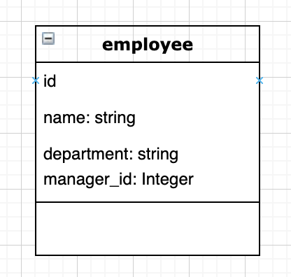

# README - Employee System Assignment 

## Technologies used
- Ruby
- Javascript
- HTML
- CSS
- Rails 
- PostgreSQL
- Bootstrap


## Approach
- As the initial instructions stated a CRUD application, I chose Ruby on Rails as it would ease the process of dealing with all CRUD actions.
- This left me more time to deal with the main issue which was accessing the hiearchy of each employee in the SHOW route. 
- I created an ERD of what a table would look like deciding finally to go with a single employee table that has an ID, a name, and a manager_id which would be referencing the employee's ID.(Shown Below) 



- The biggest issue was dealing with the recursive query that would handle fetching the employee's manager and every subsequent manager. The query is as follows: 

```
 @hierarchy = Employee.find_by_sql("
      WITH RECURSIVE EmployeeCTE AS (

        SELECT id, name, manager_id FROM employees 
        where id = #{params[:id]}
        UNION 
        SELECT employees.id, employees.name, employees.manager_id
        FROM employees JOIN EmployeeCTE
        On employees.id = EmployeeCTE.manager_id
      )
        SELECT * from EmployeeCTE
     
    ")
```

- Once this was solved I added bootstrap to add some stylings to the application. 

## Installation 
- Install Ruby & Rails (latest version)
- Install PostgreSQL
- Run Bundle Install
- Run rails db:create, db:migrate, db:seed (for dummy data)
- Run Rails server 
- Accessible on Localhost:3000
